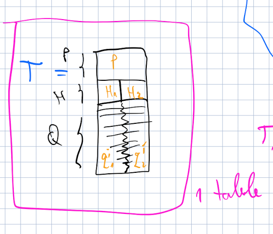

# Algorithm description

- [The following code](batch-appender.nb) is a Mathematica implementation that allows one to append a list to a special *header* object.
- the resulting object (i.e., call it `xobj`) will be a *joint* list of the original list and the header.
- the *special header* contains:
  - a first line with information about to a fixed parameter `p_i`
  - a second line with the **labels** of the two columns that will be appended

## Step-by-step procedure

1. get and set a parameter value for `p_i`
2. create the first line of the header with the numerical value of `p_1`
3. create a list of strings for the legends of the two columns -> `header={h1,h2}`
4. create a table with the data of the form `data=Table[{x_i,y_i},{i,1,n}]`
5. create the **special_header** by joining `p_i` and `header`
6. join the `data` and `special_header` to create the final object `xobj`

*Schematic showing the structure of the table*

